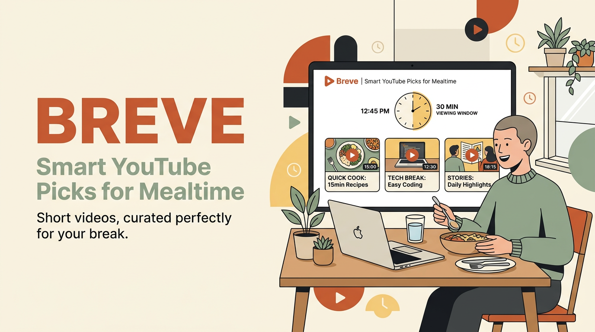

# Weekend Annoying Task Challenge: Breve

### Problem:

Choosing something to watch while eating often leads to endless scrolling and wasted time. Breve solves this by recommending up to five YouTube videos based on your meal, eating speed, preferred category, language, and available time. It uses AI to rank suitable videos so you can start watching immediately instead of searching.

## Vision & What the App Does

Breve helps people stop endlessly scrolling for something to watch while they eat.

When users sit down for breakfast, lunch, dinner, or a relaxed viewing session, they select:

- Their eating pace: **Quick eater** or **Slow eater**
- Their meal: **Breakfast**, **Lunch**, **Dinner**, or **Relaxed**
- Their preferred category: **Movies**, **Comedy**, **News**, or **Sports**
- Their preferred language: **English**, **Hindi**, or **Japanese**

Breve then finds up to five YouTube videos that match the user's preferences and fit their expected eating time. The app considers the user's eating pace when determining an appropriate video duration, so the video is more likely to finish around the same time as the meal.

The problem Breve solves is small but common: choosing what to watch can take longer than the meal itself. Instead of opening YouTube and scrolling through an overwhelming feed, users receive a short, focused lineup of recommendations.

## How I Built It

We started by reducing the problem to four simple inputs: eating pace, meal type, content category, and language. This kept the user experience fast and made the recommendation request easy to understand.

The development process was divided into three parts:

1. **Frontend experience**

   - Built a responsive React and Vite interface based on a simple wireframe.
   - Used radio-button selections so users can complete the request quickly.
   - Added loading states, error messages, responsive styling, and recommendation cards.
   - Hosted the production frontend using AWS Amplify.

2. **Backend recommendation workflow**

   - Created an API Gateway endpoint that accepts the user's selections.
   - Used AWS Lambda to validate the request and calculate an acceptable video-duration range.
   - Called the YouTube Data API to retrieve candidate videos.
   - Applied hard filters in Lambda for duration, language, category, and video availability.
   - Sent the filtered candidates to Amazon Bedrock with Amazon Nova for semantic ranking.
   - Returned the top five recommendations, including the title, duration, thumbnail, URL, channel, and a short explanation.

3. **Deployment and permissions**
   - Defined the backend infrastructure using AWS CloudFormation.
   - Created an IAM execution role for Lambda.
   - Granted Lambda permission to invoke the Bedrock model and write logs to CloudWatch.
   - Kept the YouTube API key in the Lambda environment rather than exposing it in the frontend.

A key design decision was to let Lambda perform deterministic filtering before calling Bedrock. Bedrock is not used to scrape YouTube or enforce basic duration rules. YouTube retrieves candidates, Lambda removes videos that do not meet the hard requirements, and Bedrock ranks the remaining candidates based on relevance and quality.

One challenge was that the YouTube API's duration filter is coarse. Its `videoDuration` option only provides broad categories such as medium or long. We overcame this by retrieving the detailed duration from the video metadata and applying the exact tolerance in Lambda.

Another challenge was handling Amazon Bedrock inference-profile permissions. Amazon Nova can be invoked through an inference profile, so the Lambda execution role had to allow `bedrock:InvokeModel` for both the inference profile and the underlying foundation model.

## AWS Services Used / Architecture Overview

### AWS services

- **AWS Amplify Hosting** — Hosts the React/Vite frontend.
- **Amazon API Gateway** — Provides the `POST /recommend` backend endpoint.
- **AWS Lambda** — Validates inputs, calculates duration ranges, calls YouTube, filters candidates, and invokes Bedrock.
- **Amazon Bedrock with Amazon Nova** — Ranks filtered YouTube candidates and generates short recommendation explanations.
- **Amazon CloudWatch Logs** — Stores Lambda execution logs and errors.
- **AWS IAM** — Controls Lambda permissions for CloudWatch and Bedrock.
- **AWS CloudFormation** — Defines and deploys the backend resources.

### External service

- **YouTube Data API v3** — Retrieves public video search results and detailed metadata such as duration, thumbnails, titles, channels, and view counts.

### Architecture diagram

### How the AI recommendation step is triggered

The AI step is triggered synchronously by Lambda after the user submits the form:

1. The frontend sends the four selections to API Gateway.
2. API Gateway invokes the Lambda recommendation handler.
3. Lambda calls the YouTube Data API and filters the candidate videos.
4. Lambda invokes Amazon Bedrock with Amazon Nova, passing only the filtered candidates.
5. Nova ranks the candidates and returns the best five video IDs with short reasons.
6. Lambda validates those IDs against the original candidate list and returns the final response to the frontend.

The model is instructed to select only from the supplied candidates and not invent video IDs, URLs, titles, or durations.

## What I Learned

- How to design a small product around one repetitive weekly task instead of building a broad entertainment platform.
- How to build and deploy a React/Vite frontend for AWS Amplify Hosting.
- How API Gateway and Lambda can provide a lightweight serverless backend without a database.
- How to use the YouTube Data API to retrieve video metadata and work with API quota limitations.
- How to separate deterministic business rules from AI reasoning: Lambda handles exact filtering while Bedrock handles semantic ranking.
- How Amazon Bedrock inference profiles affect IAM permissions and why both inference-profile and foundation-model resources may need to be allowed.
- How to keep third-party API keys on the backend instead of exposing them in browser code.
- How to define AWS infrastructure and permissions using CloudFormation.

## Link to App or Repo

- **Live app:** https://staging.d22h05ez18j6uf.amplifyapp.com/
